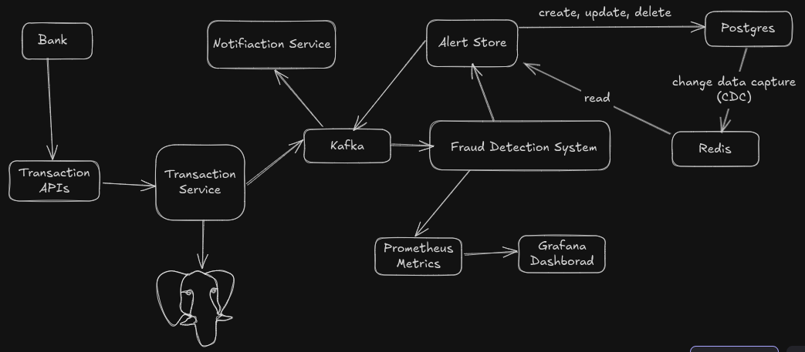

# 🚨 Fraud Detection System

A **real-time fraud detection tool** built with **Java** and **Spring Boot**, designed for extremely high throughput and scalable microservices environments. This project demonstrates modern fraud detection techniques, including rule-based and anomaly-based detection, leveraging Kafka, Redis, PostgreSQL, and container orchestration.

---
## Flow Diagram


## ✨ Features

- **Real-time transaction analysis** via Kafka event streaming
- **Rule-based & anomaly-based fraud detection**
- **Scalable microservices architecture** (Docker, Kubernetes)
- **Metrics & monitoring** (Prometheus, Grafana)
- **RESTful APIs** for transaction and alert management
- **OpenAPI documentation** for easy integration

---

## 🚀 Quick Start

### 1. Clone the repository

```sh
git clone https://github.com/viiku/fraud-detection.git
cd fraud-detection
```

### 2. Build the project

```sh
./mvnw clean package
```

### 3. Run with Docker Compose

```sh
cd deploy
docker-compose up --build
```

### 4. Access the application

- **API:** [http://localhost:8080/api/v1/transactions](http://localhost:8080/api/v1/transactions)
- **Swagger UI:** [http://localhost:8080/swagger-ui.html](http://localhost:8080/swagger-ui.html)
- **Grafana:** [http://localhost:3000](http://localhost:3000) (default user: admin / admin)
- **Prometheus:** [http://localhost:9090](http://localhost:9090)

---

## 📚 Documentation

- [API Docs (Swagger)](http://localhost:8080/swagger-ui.html)
- [Prometheus Metrics](http://localhost:8080/actuator/prometheus)

---

## 🛠️ Technologies Used

- Java 21, Spring Boot
- Kafka, Redis, PostgreSQL
- Docker, Kubernetes
- Prometheus, Grafana

---

## 🤝 Contributing

Feel free to open issues or submit pull requests for improvements!